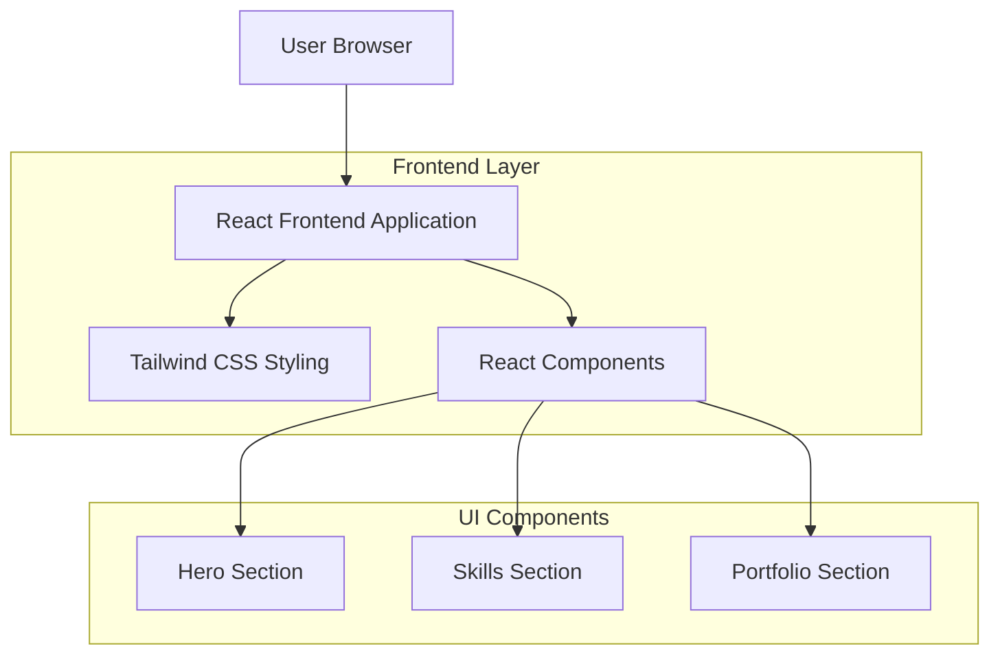

## 1. Architecture design



## 2. Technology Description
- Frontend: React@18 + tailwindcss@3 + vite
- Initialization Tool: vite-init
- Backend: None (static portfolio site)

## 3. Route definitions
| Route | Purpose |
|-------|---------|
| / | Single-page portfolio with all sections |

## 4. Component Structure

### 4.1 Core Components
```
App
├── Header
├── HeroSection
│   ├── Avatar
│   ├── Headline
│   ├── Description
│   └── CTAButtons
├── SkillsSection
│   ├── SectionHeader
│   ├── Introduction
│   ├── SkillProgressBars
│   └── TechIcons
├── PortfolioSection
│   ├── SectionHeader
│   ├── ProjectGrid
│   │   └── ProjectCard (×6)
│   └── ProjectDetails
└── SidebarNavigation
```

### 4.2 Component Props Types
```typescript
interface HeroProps {
  name: string;
  role: string;
  description: string;
  avatarUrl: string;
}

interface SkillProps {
  name: string;
  level: number;
  color: string;
}

interface ProjectProps {
  id: number;
  title: string;
  description: string;
  technologies: string[];
  imageUrl: string;
  status: 'BUILD COMPLETE' | 'IN PROGRESS';
}

interface ButtonProps {
  text: string;
  variant: 'primary' | 'secondary';
  onClick?: () => void;
  glow?: boolean;
}
```

## 5. Styling Architecture

### 5.1 Tailwind Configuration
```javascript
// tailwind.config.js
module.exports = {
  theme: {
    extend: {
      colors: {
        'navy-dark': '#0D1B2A',
        'navy-medium': '#1B263B',
        'navy-light': '#415A77',
        'cyan-glow': '#00D9FF',
        'cyan-light': '#00B4D8',
        'blue-gradient': '#0077B6',
      },
      animation: {
        'glow': 'glow 2s ease-in-out infinite alternate',
        'progress': 'progress 1s ease-out',
      },
      keyframes: {
        glow: {
          '0%': { boxShadow: '0 0 5px #00D9FF, 0 0 10px #00D9FF' },
          '100%': { boxShadow: '0 0 20px #00D9FF, 0 0 30px #00D9FF' },
        },
        progress: {
          '0%': { width: '0%' },
          '100%': { width: 'var(--progress-width)' },
        },
      },
    },
  },
  plugins: [],
}
```

### 5.2 CSS Classes Structure
```css
/* Card Components */
.card-dark {
  @apply bg-navy-dark rounded-2xl shadow-2xl border border-navy-light;
}

/* Button Components */
.btn-primary {
  @apply bg-blue-gradient text-white px-8 py-3 rounded-full font-medium transition-all duration-300 hover:shadow-lg hover:shadow-cyan-glow/50;
}

.btn-secondary {
  @apply border-2 border-cyan-glow text-white px-8 py-3 rounded-full font-medium transition-all duration-300 hover:bg-cyan-glow hover:text-navy-dark;
}

/* Text Components */
.text-gradient {
  @apply bg-gradient-to-r from-cyan-glow to-blue-gradient bg-clip-text text-transparent;
}

/* Progress Bar */
.progress-bar {
  @apply h-2 bg-navy-light rounded-full overflow-hidden;
}

.progress-fill {
  @apply h-full bg-gradient-to-r from-cyan-glow to-blue-gradient rounded-full transition-all duration-1000;
}
```

## 6. Performance Optimization

### 6.1 Image Optimization
- Use next-generation formats (WebP, AVIF)
- Implement lazy loading for project thumbnails
- Optimize avatar and hero images for web

### 6.2 Code Splitting
- Lazy load portfolio section components
- Implement intersection observer for scroll animations
- Use React.memo for static components

### 6.3 Build Optimization
- Enable tree shaking in Vite configuration
- Minimize CSS bundle size with Tailwind's JIT mode
- Implement proper caching strategies